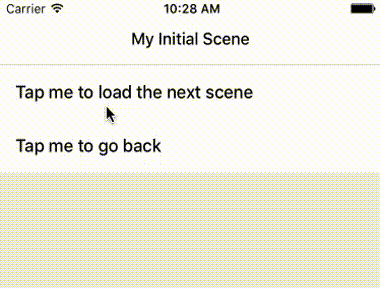
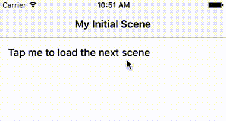

本文档总结对比了React Native中现有的几个导航组件。如果你刚开始接触，那么直接选择`Navigator`就好。如果你只针对iOS平台开发，并且想和系统原生外观一致，那么可以选择`NavigatorIOS`。如果你想更好地管理导航栈，那么应该尝试一下`NavigationExperimental`。

## Navigator

`Navigator`使用纯JavaScript实现了一个导航栈，因此可以跨平台工作，同时也便于定制。这也是我们在[使用导航器跳转页面](using-navigators.html)的教程中示例用的组件。



`Navigator`可以在`renderScene`方法中根据当前路由渲染不同的组件。默认情况下新的场景会从屏幕右侧滑进来，但你也可以通过`configureScene`方法来管理这一行为。你还可以通过`navigationBar`属性来配置一个跨场景的导航栏。（译注：但我们不推荐使用跨场景的navigationBar，它的代码逻辑维护起来很困难！建议自己在场景中用`View`实现自定义的导航栏。）

点击这里阅读[Navigator的API文档](navigator.html)。

## NavigatorIOS

如果你只针对iOS平台开发，那么可以考虑使用[NavigatorIOS](navigatorios.html)。它是基于 [`UINavigationController`](https://developer.apple.com/library/ios/documentation/UIKit/Reference/UINavigationController_Class/)封装的，所以看起来很像。



```javascript
<NavigatorIOS
  initialRoute={ {
    component: MyScene,
    title: 'My Initial Scene',
    passProps: { myProp: 'foo' },
  } }
/>
```

用法类似`Navigator`，`NavigatorIOS`也使用路由对象来描述场景，但有一些重要区别。其中要渲染的组件在路由对象的`component`字段中指定，要给目标组件传递的参数则写在`passProps`中。被渲染的component都会自动接受到一个名为`navigator`的属性，你可以直接调用此对象(this.props.navigator)的`push`和`pop`方法。

由于`NavigatorIOS`使用的是原生的UIKit导航，所以它会自动渲染一个带有返回按钮和标题的导航栏。

```javascript
import React, { Component, PropTypes } from 'react';
import { NavigatorIOS, Text, TouchableHighlight, View } from 'react-native';

export default class NavigatorIOSApp extends Component {
  render() {
    return (
      <NavigatorIOS
        initialRoute={ {
          component: MyScene,
          title: 'My Initial Scene',
        } }
        style={ {flex: 1} }
      />
    )
  }
}

class MyScene extends Component {
  static propTypes = {
    title: PropTypes.string.isRequired,
    navigator: PropTypes.object.isRequired,
  }

  constructor(props, context) {
    super(props, context);
    this._onForward = this._onForward.bind(this);
  }

  _onForward() {
    this.props.navigator.push({
      title: 'Scene ' + nextIndex,
    });
  }

  render() {
    return (
      <View>
        <Text>Current Scene: { this.props.title }</Text>
        <TouchableHighlight onPress={this._onForward}>
          <Text>Tap me to load the next scene</Text>
        </TouchableHighlight>
      </View>
    )
  }
}
```

点击这里阅读[Navigator的API文档](navigatorios.html)。

> 你还可以看看[react-native-navigation](https://github.com/wix/react-native-navigation)，这是一个第三方的组件，旨在于提供原生的跨平台的导航组件。

## NavigationExperimental

`Navigator`和`NavigatorIOS`都是有状态的组件。如果你在app中多处使用这些组件，那么维护工作就会变得非常麻烦。`NavigationExperimental`以不同的方式实现了导航，它可以使用任何视图来作为导航视图，同时还用到了规约函数（reducer）自顶向下地管理状态。正如名字中的`Experimental`所示，这一组件的整体实现具有一定的实验性，但我们仍然建议你尝试一下用它去更好地管理应用的导航。

```javascript
<NavigationCardStack
  onNavigateBack={onPopRouteFunc}
  navigationState={myNavigationState}
  renderScene={renderSceneFun}
/>
```

引入`NavigationExperimental`的步骤和React Native中的其他组件一样。在引入此组件之后，还可以进一步解构其中一些有用的子组件，比如这里我们会从中解构`NavigationCardStack`和 `NavigationStateUtils`这两个子组件。

```javascript
import React, { Component } from 'react';
import { NavigationExperimental } from 'react-native';

const {
  CardStack: NavigationCardStack,
  StateUtils: NavigationStateUtils,
} = NavigationExperimental;
```

正如上文所说，`NavigationExperimental`的实现机制与`Navigator`和`NavigatorIOS`有所不同。用它来构筑导航栈还需要一些额外的步骤，但这些步骤并不是无用功。

### 第一步：定义初始状态和根容器

首先创建一个新组件，我们会把它作为根容器，并在这里定义初始状态。导航栈会定义在`navigationState`字段中，其中也包含了初始的路由定义：

```javascript
class BleedingEdgeApplication extends Component {
  constructor(props, context) {
    super(props, context);

    this.state = {
      // 定义初始的导航状态
      navigationState: {
        index: 0, // 现在是第一页（索引从0开始）
        routes: [{key: 'My Initial Scene'}], // 初始仅设定一个路由
      },
    };

    // 我们稍后再补充此函数的实现细节
    this._onNavigationChange = this._onNavigationChange.bind(this);
  }

  _onNavigationChange(type) {
    // 我们稍后再补充此函数的实现细节
  }

  render() {
    return (
      <Text>这是一段占位的文字。稍后我们会在这里渲染导航。</Text>
    );
  }
}
```

现在我们定义了一个有状态的组件，然而暂时并无太多卵用。我们的初始状态包含了一个路由对象，以及当前页面的索引值。但是这看起来跟Navigator的初始路由定义好像没什么区别嘛！回忆一下navigator对象提供了哪些操作？——对的，push和pop，看起来也非常直观。但是前面我们说过了，现在我们会在根容器上使用规约函数来管理状态。下面注意仔细看好了。

### 第二步：规约导航状态

NavigationExperimental内置了一些有用的规约函数（reducer），都放在NavigationStateUtils中。我们现在要用的两个就是push和pop了。它们接受一个navigationState对象参数，然后返回新的navigationState对象。

据此我们可以这样来编写`_onNavigationChange`函数，在其中判断"push"和"pop"的行为，并分别规约对应的状态。

```javascript
_onNavigationChange(type) {
  // 从state中解构出navigationState
  let {navigationState} = this.state;

  switch (type) {
    case 'push':
      // push一个新路由，在这里就是一个带有key属性的对象。
      // 我个人喜欢随机数的key（但是说正经的，key必须要确保唯一性）
      const route = {key: 'Route-' + Date.now()};

      // 调用NavigationStateUtils提供的push规约函数
      navigationState = NavigationStateUtils.push(navigationState, route);
      break;

    case 'pop':
      // 使用pop函数来弹出当前路由
      navigationState = NavigationStateUtils.pop(navigationState);
      break;
  }

  // 如果没有实际变化，则NavigationStateUtils会返回同样的`navigationState`
  // 我们只会更新确实发生变化的状态
  if (this.state.navigationState !== navigationState) {
    // 请记住更新状态必须通过setState()方法！
    this.setState({navigationState});
    // 如果你还不了解ES6中的新语法，那么简单讲解一下上面那一句
    // 如果key和value的字面一样，那么可以简写成一个，等同于下面的写法：
    // this.setState({navigationState: navigationState});
  }
}
```

Cool.我们已经触碰到了NavigationExperimental的精髓之所在。这里我们只处理了两种行为，实际开发中行为可能更复杂，比如可能会考虑后退（back）行为，又或者是tab间的切换过渡行为等等。

我们现在还没写初始场景和实际的导航器，不过别急，我们一步一步来。

### 第三步：定义场景

为方便起见我们先定义一个Row（行）组件。其中显示了一些文字，并带有点击事件。

```javascript
class TappableRow extends Component {
  render() {
    return (
      <TouchableHighlight
        style={styles.row}
        underlayColor="#D0D0D0"
        onPress={this.props.onPress}>
        <Text style={styles.buttonText}>
          {this.props.text}
        </Text>
      </TouchableHighlight>
    );
  }
}
```

现在来定义实际的场景。其中用到了一个ScrollView来显示一个垂直列表，第一行显示当前路由对象的key字段值，后两行用来点击后调用导航器的push和pop方法。

```javascript
class MyVeryComplexScene extends Component {
  render() {
    return (
      <ScrollView style={styles.scrollView}>
        <Text style={styles.row}>
          Route: {this.props.route.key}
        </Text>
        <TappableRow
          text="Tap me to load the next scene"
          onPress={this.props.onPushRoute}
        />
        <TappableRow
          text="Tap me to go back"
          onPress={this.props.onPopRoute}
        />
      </ScrollView>
    );
  }
}
```

### 第四步：创建导航栈

我们之前已经定义了状态和管理状态的规约函数，现在可以创建导航器组件了。在写导航器的同时，我们可以使用当前路由的属性来配置场景并渲染它了。

```javascript
class MyVerySimpleNavigator extends Component {

  // 在这里绑定一些导航用的方法
  constructor(props, context) {
    super(props, context);

    this._onPushRoute = this.props.onNavigationChange.bind(null, 'push');
    this._onPopRoute = this.props.onNavigationChange.bind(null, 'pop');

    this._renderScene = this._renderScene.bind(this);
  }

  // Now we finally get to use the `NavigationCardStack` to render the scenes.
  render() {
    return (
      <NavigationCardStack
        onNavigateBack={this._onPopRoute}
        navigationState={this.props.navigationState}
        renderScene={this._renderScene}
        style={styles.navigator}
      />
    );
  }

  // 根据路由来渲染场景
  // `sceneProps`的具体结构定义在`NavigationTypeDefinition`的`NavigationSceneRendererProps`中
  // 这里你可以根据路由的不同来返回不同的场景组件，我们这里为了简要说明，始终只返回这一个场景组件
  _renderScene(sceneProps) {
    return (
      <MyVeryComplexScene
        route={sceneProps.scene.route}
        onPushRoute={this._onPushRoute}
        onPopRoute={this._onPopRoute}
        onExit={this.props.onExit}
      />
    );
  }
}
```

差不多了！我已经可以闻到终点线的味道啦。现在把我们新做的导航器放到根容器中：

```javascript
class BleedingEdgeApplication extends Component {

  // 为了简化说明，这里省略了constructor和其他的方法

  render() {
    return (
      <MyVerySimpleNavigator
        navigationState={this.state.navigationState}
        onNavigationChange={this._onNavigationChange}
        onExit={this._exit}
      />
    );
  }
}
```

完工了！赞美NavigationExperimental吧！

#### 等一下——好像少了什么？

(啊没错，我们忘了引入组件和样式。)

```javascript
import { NavigationExperimental, PixelRatio, ScrollView, StyleSheet, Text, TouchableHighlight } from 'react-native';

const styles = StyleSheet.create({
  navigator: {
    flex: 1,
  },
  scrollView: {
    marginTop: 64
  },
  row: {
    padding: 15,
    backgroundColor: 'white',
    borderBottomWidth: 1 / PixelRatio.get(),
    borderBottomColor: '#CDCDCD',
  },
  rowText: {
    fontSize: 17,
  },
  buttonText: {
    fontSize: 17,
    fontWeight: '500',
  },
});
```

### 小作业

你现在是导航器的专家了！参考下我们写的[NavigationExperimental的例子](https://github.com/facebook/react-native/tree/master/Examples/UIExplorer/js/NavigationExperimental)，学习如何实现其他类型的导航结构，比如多个tab对应多个导航栈的情况。

